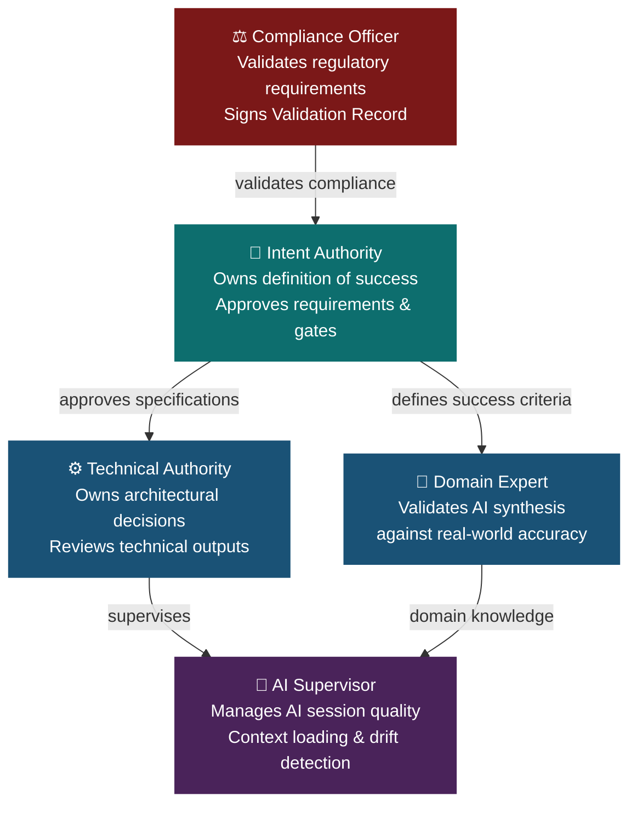
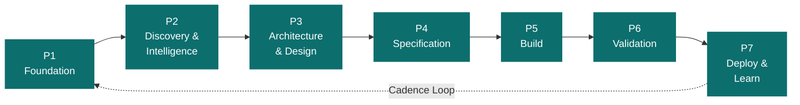
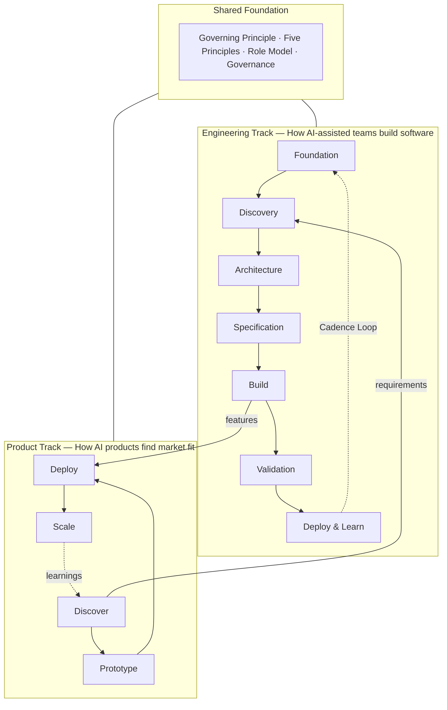
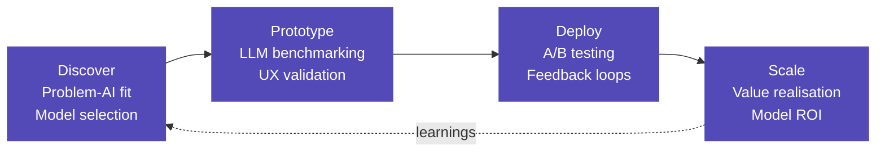
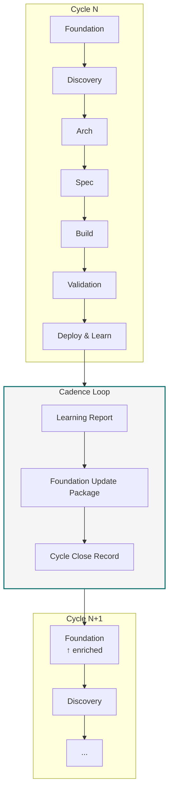
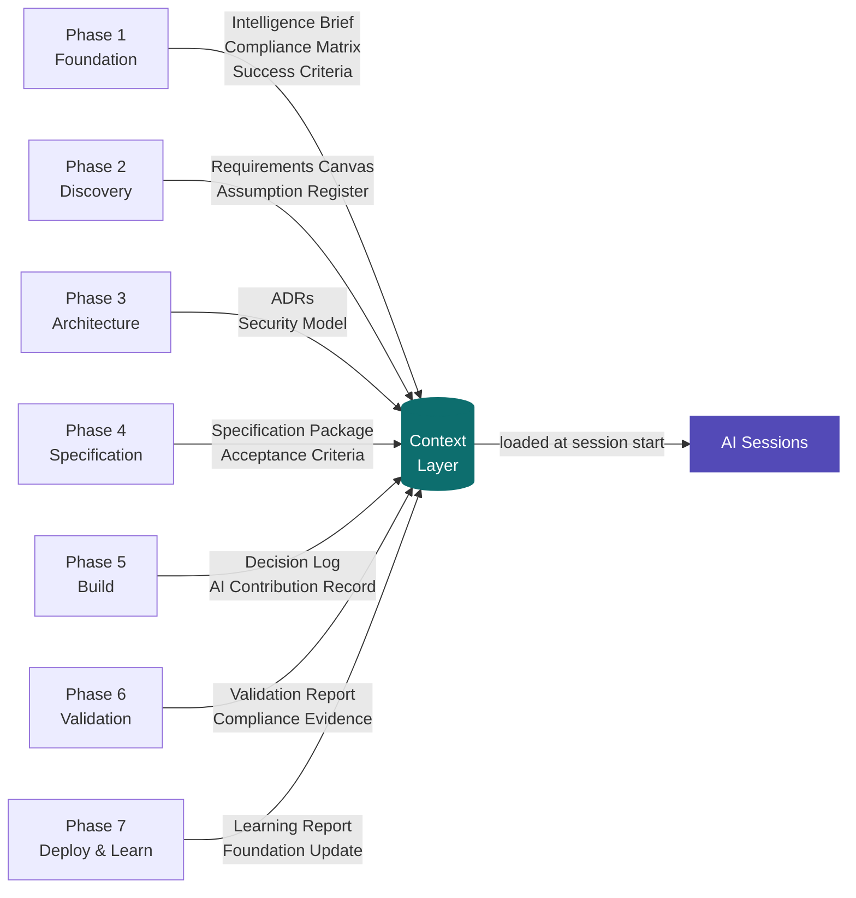
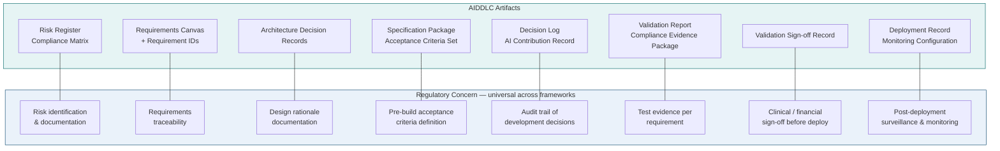

# AIDDLC Standard
## AI-Driven Development Lifecycle — v1.0.0

**Status:** Public Release
**Published:** 2026
**Maintained by:** [10QBIT Technologies](https://10qbit.ai)
**Specification URL:** [aiddlc.ai](https://aiddlc.ai)
**GitHub:** [github.com/aiddlc/standard](https://github.com/aiddlc/standard)
**Licence:** [CC BY 4.0](https://creativecommons.org/licenses/by/4.0/)

> **How to cite:**
> *AIDDLC Standard v1.0.0, 10QBIT Technologies, 2026, https://aiddlc.ai/spec*

---

## Table of Contents

1. [Governing Principle](#1-governing-principle)
2. [The Five Principles](#2-the-five-principles)
3. [Role Definitions](#3-role-definitions)
4. [Phase Architecture](#4-phase-architecture)
5. [Engineering Track — Phase Definitions](#5-engineering-track--phase-definitions)
6. [Product Track](#6-product-track)
7. [The Cadence Loop](#7-the-cadence-loop)
8. [Context Continuity Model](#8-context-continuity-model)
9. [Compliance Integration](#9-compliance-integration)
10. [Conformance Requirements](#10-conformance-requirements)
11. [Governance](#11-governance)
12. [Glossary](#12-glossary)

---

## 1. Governing Principle

> *"Humans define intent and validate outcomes. AI executes craft and maintains continuity. Every decision is preserved. Every output is auditable. Quality is a system property, not a human heroic act."*

This principle is not a guideline. It is the invariant from which all other elements of the AIDDLC Standard derive. Any implementation that violates it is not AIDDLC-compliant, regardless of how many other elements it satisfies.

The principle encodes four non-negotiable truths:

**1. Human authority is structural, not aspirational.**
The boundary between human and AI responsibility is defined in the specification, not negotiated at runtime. Humans own intent; AI owns execution. This division is fixed.

**2. AI continuity is an active responsibility.**
AI does not merely generate outputs. It accumulates, maintains, and propagates context across all phases. Context loss is a defect, not an expected degradation.

**3. Preservation is mandatory.**
Every material decision — including decisions to defer, reject, or revisit — must be recorded. An undocumented decision does not exist for the purposes of this specification.

**4. Quality emerges from system design, not individual effort.**
The AIDDLC Standard treats quality as an architectural property, enforced by phase gates and artifact standards. No phase may compensate for defects from a prior phase through effort alone.

---

## 2. The Five Principles

The Governing Principle is expressed in practice through five operational principles. These principles govern how roles behave, how phases are structured, and what gate criteria are valid. Implementations may extend these principles but may not contradict them.

```
┌─────────────────────────────────────────────────────────────────┐
│  01  Intent over implementation                                  │
│      Humans own the WHAT and WHY. AI owns the HOW.              │
├─────────────────────────────────────────────────────────────────┤
│  02  Context never dies                                          │
│      Every decision feeds every future decision.                 │
│      Zero decay at handoffs.                                     │
├─────────────────────────────────────────────────────────────────┤
│  03  Gates before generation                                     │
│      No AI output without human-defined acceptance criteria.     │
├─────────────────────────────────────────────────────────────────┤
│  04  Continuous validation                                       │
│      Quality verified at every phase, not tested at the end.    │
├─────────────────────────────────────────────────────────────────┤
│  05  Auditable by design                                         │
│      Every output, decision, and rationale logged                │
│      and attributable. Default operating mode, not audit mode.  │
└─────────────────────────────────────────────────────────────────┘
```

### 2.1 Intent over implementation

Humans define what the system must do and why. AI determines how to do it. The what and the why are written before AI execution begins — they are the acceptance criteria, the user stories, the compliance requirements, the success metrics. AI may propose implementation options, but the selection belongs to a human.

**Violation:** allowing AI to define scope, derive requirements from code, or generate acceptance criteria without explicit human review and sign-off.

### 2.2 Context never dies

Information generated in any phase is available to every subsequent phase. There is no re-discovery, no repeated elicitation, no knowledge lost at handoffs. AIDDLC implementations must maintain a living knowledge base — the **Context Layer** — that accumulates and is never overwritten, only extended.

**Violation:** beginning a phase without first loading relevant prior-phase context; repeating elicitation or research already performed; generating outputs that contradict established decisions without a documented rationale.

### 2.3 Gates before generation

No AI generation begins without human-approved acceptance criteria. This principle applies at every level: before a feature is built, before a document is drafted, before a test suite is generated.

**Violation:** beginning implementation before acceptance criteria are approved; allowing AI to generate output and then derive criteria from that output; declaring a gate passed without explicit human sign-off.

### 2.4 Continuous validation

Validation is not a phase. It is an activity present in every phase. Each phase has defined validation activities that must occur before the phase gate. The Validation phase (Phase 6) is the comprehensive integration validation — it does not substitute for in-phase validation.

**Violation:** deferring all validation to a single phase; passing a phase gate without completing that phase's defined validation activities.

### 2.5 Auditable by design

Every output, decision, and rationale produced during the lifecycle must be attributable, timestamped, and retrievable. This is not an audit-mode feature. It is the default operating mode of an AIDDLC implementation.

Auditability requires: a defined artifact format for each phase output; a Decision Log capturing what was decided, by whom, when, and on what basis; an AI Contribution Record distinguishing AI-generated content from human-reviewed content; and a Chain of Custody from requirement to deployed code.

**Violation:** undocumented decisions; outputs with no provenance; inability to trace a deployed feature to its originating requirement and approval.

---

## 3. Role Definitions

AIDDLC is explicitly multi-stakeholder. The specification defines five canonical roles. Implementations may combine roles or subdivide them, but the responsibilities of each role must be assigned to a human being. **AI may not hold a role.**



| Role | Short | Core Responsibility |
|------|-------|---------------------|
| Intent Authority | IA | Owns the definition of success. Approves requirements, acceptance criteria, and scope changes. Signs off on phase gates. Cannot be delegated to AI. |
| Domain Expert | DE | Provides domain knowledge. Validates AI synthesis against real-world accuracy. Participates in Discovery and Validation phases. |
| Technical Authority | TA | Makes and owns architectural decisions. Reviews and approves AI-generated technical outputs. Responsible for the Architecture Decision Record. |
| AI Supervisor | AIS | Manages AI session quality, context loading, prompt engineering, and output review. Monitors for context drift and principle violations. |
| Compliance Officer | CO | Ensures regulatory requirements are correctly captured and that all phase outputs satisfy applicable standards. Mandatory for regulated implementations. |

> In small teams, Intent Authority, Domain Expert, and Technical Authority may be the same person. The Compliance Officer role is mandatory for regulated implementations. The AI Supervisor role may be rotated.

---

## 4. Phase Architecture

AIDDLC defines two tracks operating in parallel: the **Engineering Track** (7 phases) and the **Product Track** (4 phases). Both share the same governing principle, five principles, and role model.

### 4.1 Engineering Track overview



### 4.2 Dual-track overview



### 4.3 What every phase contains

Each phase has:
- A **purpose** — what the phase is for
- **AI responsibilities** — what AI does in this phase
- **Human responsibilities** — what humans do that AI cannot
- **Required artifacts** — what must exist at phase end
- A **phase gate** — criteria that must be satisfied before the next phase begins
- A **context handoff** — what gets added to the Context Layer

Phases may overlap in time. A subsequent phase may begin before its predecessor is fully complete, provided relevant gate criteria are satisfied. This is **partial gate passage** and must be documented.

---

## 5. Engineering Track — Phase Definitions

### Phase 1 — Foundation

> *Establish the project's intelligence context before any creative or technical work begins.*

**Purpose:** Foundation is not planning. It is the construction of the knowledge base that all subsequent phases draw from.

**AI responsibilities:**
- Scan regulatory landscape applicable to the domain and jurisdiction
- Synthesise existing organisational knowledge, prior project learnings, and domain literature
- Generate a draft Compliance Matrix identifying applicable standards
- Produce an initial Risk Register from regulatory and technical signals
- Populate the Context Layer with synthesised domain knowledge

**Human responsibilities:**
- Define the project's success criteria — what good looks like at the end
- Establish risk tolerances and non-negotiable constraints
- Map all stakeholders and their authority levels
- Review and approve the AI-generated Compliance Matrix — corrections are mandatory
- Sign off on the Context Layer seed

**Required artifacts:**

| Artifact | Description |
|----------|-------------|
| Intelligence Brief | Synthesised domain intelligence — reviewed and approved by humans |
| Compliance Matrix v0 | Applicable standards mapped to requirements |
| Stakeholder Map | All roles assigned to named individuals |
| Success Criteria | Human-approved definition of done |
| Constraint Register | All non-negotiables documented |
| Risk Register v0 | Initial risk identification |

**Gate criteria:**
- [ ] Success Criteria approved by Intent Authority
- [ ] Compliance Matrix reviewed by Compliance Officer (regulated implementations)
- [ ] All roles assigned to named individuals
- [ ] Constraint Register complete
- [ ] Context Layer seeded and accessible

**Context handoff:** Intelligence Brief, Compliance Matrix, Success Criteria, and Constraint Register committed to Context Layer. These documents may be updated but never deleted.

---

### Phase 2 — Discovery & Intelligence

> *Deep research into user needs, market context, and technical landscape.*

**Purpose:** Discovery produces the requirements that Specification will formalise. AI synthesises — humans validate.

**AI responsibilities:**
- Mine available user research, support data, and behavioural signals
- Synthesise requirements from domain expert interviews and stakeholder inputs
- Map the competitive and technical landscape
- Identify patterns and contradictions in the requirements signal
- Generate a draft Assumption Register

**Human responsibilities:**
- Conduct primary research — interviews, observation, domain expertise
- Validate AI synthesis against lived knowledge: correct, add, or reject
- Prioritise requirements — AI cannot determine relative importance
- Challenge AI-identified assumptions
- Approve the final Requirements Canvas before gate passage

**Required artifacts:** User Intelligence Report · Requirements Canvas · Market & Technical Map · Assumption Register · Prioritised Requirement List

**Gate criteria:**
- [ ] Requirements Canvas approved by Intent Authority
- [ ] Domain Expert has validated synthesis
- [ ] All requirements traceable to a source
- [ ] No unresolved contradictions in requirements

**Context handoff:** Requirements Canvas and Prioritised Requirement List committed to Context Layer.

---

### Phase 3 — Architecture & Design

> *Define the technical and experience architecture that will contain the Build phase.*

**Purpose:** AI generates options and evaluates trade-offs — humans make decisions and own them.

**AI responsibilities:**
- Generate multiple architectural options for each major technical decision
- Evaluate options against the Constraint Register and Compliance Matrix
- Produce design variants for key user journeys
- Identify integration points, security boundaries, and data flows
- Document trade-offs for each option with explicit rationale

**Human responsibilities:**
- Select the architecture — AI presents options, humans choose
- Author and own Architecture Decision Records (ADRs) — one per major decision
- Approve the Security Model — cannot be delegated to AI
- Validate design against domain expert and user knowledge
- Confirm architecture satisfies Compliance Matrix requirements

**Required artifacts:** Architecture Decision Records · System Design Document · Security Model · Integration Map · Data Model v0 · Design System

**Gate criteria:**
- [ ] All major architectural decisions recorded as ADRs
- [ ] Security Model approved by Technical Authority
- [ ] Architecture validated against Compliance Matrix
- [ ] No open architectural questions

**Context handoff:** All ADRs, Security Model, and Integration Map committed to Context Layer. Architecture decisions become constraints for all subsequent phases.

---

### Phase 4 — Specification

> *Translate architectural decisions and requirements into precise, unambiguous specifications that govern the Build phase.*

**Purpose:** A feature is not ready to build until its specification is complete and approved.

**AI responsibilities:**
- Generate detailed feature specifications from approved requirements and architecture
- Produce acceptance criteria for every specified feature — testable, unambiguous, complete
- Draft API contracts, data schemas, and integration specifications
- Generate edge case and failure scenario inventories
- Identify specification gaps and surface them for human resolution

**Human responsibilities:**
- Review every specification — AI drafts, humans approve
- Approve acceptance criteria — no feature enters Build without approved criteria
- Resolve all gaps and ambiguities identified by AI
- Validate specifications against domain reality and regulatory requirements
- Sign off on the complete Specification Package

**Required artifacts:** Feature Specifications · Acceptance Criteria Set · API Contracts · Data Schema · Edge Case Register · Test Scenario Set

**Gate criteria:**
- [ ] Every in-scope feature has an approved specification
- [ ] Every specification has approved acceptance criteria
- [ ] API contracts reviewed by Technical Authority
- [ ] No unresolved specification gaps
- [ ] Specification Package signed off by Intent Authority

**Context handoff:** Complete Specification Package committed to Context Layer. Modifications require formal amendment and re-approval.

---

### Phase 5 — Build

> *AI-executed implementation under human supervision.*

**Purpose:** AI implements to specification. Humans supervise, review, and approve. No autonomous deployment.

**AI responsibilities:**
- Implement features to specification — code, tests, and configuration
- Document implementation decisions in the Decision Log
- Flag specification ambiguities immediately for human resolution
- Run in-phase validation on all outputs (unit tests, lint, security scan)
- Maintain context continuity — each session loads relevant prior context before starting

**Human responsibilities:**
- Supervise AI sessions — review outputs at defined checkpoints, not only at completion
- Resolve specification ambiguities — AI pauses, humans decide, decisions are logged
- Review and approve all Pull Requests — no AI-generated code merges without human review
- Monitor for context drift
- Approve the build for gate review

**Required artifacts:** Source Code · Test Suite · Deployment Configuration · Build Logs · Decision Log · AI Contribution Record

**Gate criteria:**
- [ ] All acceptance criteria have corresponding passing tests
- [ ] Security scan clean — no unresolved high or critical findings
- [ ] All Pull Requests reviewed and approved by a human
- [ ] Decision Log complete
- [ ] AI Contribution Record complete
- [ ] Technical Authority sign-off on build readiness

**Context handoff:** Decision Log and AI Contribution Record committed to Context Layer.

---

### Phase 6 — Validation

> *Independent, comprehensive verification that the built system matches the approved intent.*

**Purpose:** Validation is evidence generation, not debugging. The question is not "does it work?" but "does it satisfy the intent and comply with all requirements?"

**AI responsibilities:**
- Execute the complete Test Scenario Set against the built system
- Map test results to acceptance criteria — each criterion must be evidenced
- Generate the Validation Report with pass/fail status per criterion
- Cross-reference build outputs against the Compliance Matrix
- Identify gaps between what was built and what was specified

**Human responsibilities:**
- Conduct acceptance testing — human-in-the-loop validation of critical journeys
- Review the Compliance Evidence Package — sign off on regulatory readiness
- Evaluate any gaps — accept, reject, or defer with rationale
- Sign the Validation Sign-off Record
- Approve deployment readiness

**Required artifacts:** Validation Report · Compliance Evidence Package · Defect Register · Gap Analysis · Validation Sign-off Record

**Gate criteria:**
- [ ] All acceptance criteria have a documented validation result
- [ ] All Compliance Matrix requirements have corresponding evidence
- [ ] No open high or critical defects without explicit deferral and risk acceptance
- [ ] Validation Sign-off Record completed by Intent Authority and Compliance Officer
- [ ] Deployment approved

**Context handoff:** Complete Validation Report and Compliance Evidence Package committed to Context Layer and long-term audit storage.

---

### Phase 7 — Deploy & Learn

> *Production deployment, performance monitoring, and systematic capture of learnings to feed the next cycle.*

**Purpose:** The learning loop is not optional — it is what makes AIDDLC a self-improving system.

**AI responsibilities:**
- Monitor deployment health — errors, performance, user behaviour signals
- Capture and synthesise incoming feedback, support signals, and metric anomalies
- Generate a Learning Report
- Propose updates to the Foundation Context Layer for the next cycle
- Identify any emergent compliance signals from production behaviour

**Human responsibilities:**
- Approve production deployments — no autonomous deployment to production
- Review the Learning Report and approve proposed Foundation updates
- Feed the next cycle's Foundation phase with approved learnings
- Close the cycle formally — acknowledge that Phase 7 outputs become Phase 1 inputs

**Required artifacts:** Deployment Record · Monitoring Configuration · Learning Report · Foundation Update Package · Cycle Close Record

**Gate criteria:**
- [ ] Deployment Record complete
- [ ] Monitoring configuration active and baseline established
- [ ] Learning Report reviewed and approved
- [ ] Foundation Update Package prepared for the next cycle
- [ ] Cycle Close Record signed by Intent Authority

**Context handoff:** Learning Report and Foundation Update Package are the seed for the next Foundation phase. **The cycle is formally closed. A new cycle begins.**

---

## 6. Product Track

The Product Track defines how AI-native products find market fit, how models are selected and measured, and how product value is tracked. It operates in parallel with the Engineering Track — product decisions feed requirements into the Engineering Track; engineering outputs feed features back into the Product Track.



### 6.1 Discover

**Purpose:** Identify genuine Problem-AI fit before committing to a model or approach.

**Core questions this phase must answer:**
- Is this problem genuinely AI-addressable, or would a simpler system work better?
- What modality fits the problem — LLM, SLM, classification, retrieval, multimodal?
- What does success look like in measurable product terms?
- What data exists, what's missing, what can't be used?

**Required artifacts:** Problem-AI Fit Assessment · Model Selection Rationale · AI Metrics Definition · Data Availability Map

**Gate criteria:**
- [ ] Problem-AI fit validated — AI is the right tool for this specific problem
- [ ] Model selection rationale documented with alternatives considered
- [ ] Success metrics defined and measurable before build begins
- [ ] Data availability confirmed against requirements

> **[COMMUNITY DEVELOPMENT AREA]**
> The model selection framework — specifically the decision criteria for LLM vs SLM vs fine-tuned vs RAG approaches — is an area where community contribution is actively invited. Current practice varies widely and a shared decision framework would benefit all implementers. See `annexes/product-track-community.md`.

---

### 6.2 Prototype

**Purpose:** Validate AI behaviour against real user needs before building production infrastructure.

**Core activities:**
- LLM benchmarking — evaluate candidate models against the specific task, not general benchmarks
- Latency profiling — measure actual latency in the target user journey context
- UX validation — test AI output quality with real users, not just technical metrics
- Failure mode mapping — identify and document how the model fails

**AI-native metrics for this phase:**

| Metric | What it measures |
|--------|-----------------|
| Task accuracy | % of outputs that satisfy the defined acceptance criteria |
| Latency P50 / P95 | Response time at median and tail — both matter for UX |
| Token efficiency | Tokens consumed per successful task completion |
| Failure rate by type | Hallucination / refusal / format error — categorised, not lumped |
| Human correction rate | % of AI outputs requiring human correction before use |

**Required artifacts:** Benchmark Report · Latency Profile · UX Validation Results · Failure Mode Register · Model Selection Decision

**Gate criteria:**
- [ ] Candidate model selected with documented rationale
- [ ] Latency acceptable for the target user journey
- [ ] Failure modes understood and mitigation strategies defined
- [ ] UX validation completed with target users

> **[COMMUNITY DEVELOPMENT AREA]**
> Benchmarking methodology — how to construct domain-specific evaluation sets that reflect real usage rather than standardised benchmarks. Contributions from teams with production AI deployment experience are particularly valued.

---

### 6.3 Deploy

**Purpose:** Controlled production deployment with measurement infrastructure from day one.

**Core activities:**
- A/B testing framework — compare AI-assisted vs baseline journeys
- Feedback loop instrumentation — capture implicit and explicit user signals
- Model performance monitoring — production accuracy differs from benchmark accuracy
- Cost tracking — token consumption, latency costs, infrastructure costs

**AI-native product metrics:**

| Metric | Definition |
|--------|-----------|
| Token ROI | Business value generated per token consumed |
| AI adoption rate | % of users actively engaging with AI features vs opting out |
| Latency impact on conversion | Measured effect of AI response time on completion rate |
| Model accuracy in production | Accuracy against real usage, not benchmark data |
| Feedback signal ratio | Positive / negative implicit signals per AI interaction |

**Required artifacts:** A/B Test Design · Monitoring Dashboard Configuration · Feedback Collection Mechanism · Cost Model · Production Baseline

**Gate criteria:**
- [ ] A/B test running with statistical significance plan
- [ ] All AI-native metrics instrumented and baseline established
- [ ] Cost model confirmed against budget
- [ ] Feedback mechanism live

---

### 6.4 Scale

**Purpose:** Grow AI value realisation while managing model cost, performance, and compliance at scale.

**Core activities:**
- Model ROI optimisation — cost per successful outcome, not cost per token
- Performance at scale — latency and accuracy under production load
- Feature adoption analysis — which AI features drive retention, which don't
- Compliance at scale — audit trail completeness as volume grows

**Scale-specific considerations:**
- Model version management — how to handle model updates without breaking production
- Context window cost management — strategies for long-context efficiency
- Fallback architecture — behaviour when AI model is unavailable or degraded
- Regulatory scaling — evidence generation must scale proportionally with usage

**Required artifacts:** Model ROI Report · Scale Performance Analysis · Feature Adoption Report · Compliance Scaling Assessment · Next Cycle Input Package

**Gate criteria:**
- [ ] Token ROI positive and improving
- [ ] AI adoption rate at or above target
- [ ] Compliance evidence generation confirmed at scale
- [ ] Next Cycle Input Package prepared

> **[COMMUNITY DEVELOPMENT AREA]**
> Model ROI calculation methodology — there is no consensus on how to attribute business value to AI-specific contributions within a product. This is an active research area and community frameworks are invited. See `annexes/product-track-community.md`.

---

## 7. The Cadence Loop

The Cadence Loop is the mechanism by which AIDDLC becomes a self-improving system. It is the formal connection between Phase 7 (Deploy & Learn) and Phase 1 (Foundation) of the next cycle.



**What the Cadence Loop carries:**
- Production observations — what users actually did vs what was specified
- Model performance data — accuracy, latency, and failure modes in production
- Compliance signals — any regulatory observations from production behaviour
- Assumption invalidations — which Foundation assumptions proved wrong
- Emerging requirements — user needs discovered post-deployment

**What the Cadence Loop does not carry:**
- Scope changes — these require a new Foundation gate, not a loop update
- Architectural decisions — these require formal ADR amendment
- Compliance framework changes — these require Compliance Officer review

The Cadence Loop is what distinguishes AIDDLC from a linear waterfall with AI labels. The cycle never terminates — it improves.

---

## 8. Context Continuity Model

### 8.1 Structure

The Context Layer is a persistent, append-only store of artifacts and decisions. It has the following properties:

- **Append-only:** entries are added and annotated, never deleted. Superseded entries are marked superseded and retain their original content.
- **Versioned:** every entry carries a timestamp, a phase identifier, and the identity of the human approver.
- **Accessible:** every active role must be able to query the Context Layer. AI sessions must load relevant Context Layer entries at session start.
- **Auditable:** the complete history of the Context Layer is retrievable and immutable.



### 8.2 Loading Protocol

At the start of every AI session within a phase, the AI Supervisor must load:
- The Intelligence Brief and Compliance Matrix from Foundation
- The Requirements Canvas from Discovery
- All Architecture Decision Records relevant to the current work
- The Specification Package for the feature or component being worked on
- The Decision Log from any prior Build sessions on the same feature

AI sessions that begin without the relevant Context Layer entries loaded are in violation of this specification. **The AI Supervisor is responsible for context loading.**

### 8.3 Context Drift Detection

Context drift occurs when AI output diverges from established decisions without a documented rationale. Signs include:
- Code that contradicts an Architecture Decision Record
- Acceptance criteria that contradict an approved Specification
- A recommendation that revisits a closed decision

When context drift is detected, the AI session must be paused and the drift documented in the Decision Log before proceeding.

---

## 9. Compliance Integration

### 9.1 Universal compliance model

The AIDDLC Standard is designed to satisfy the evidential requirements of regulated industries without additional instrumentation. The core artifacts map to universal regulatory concerns applicable across all frameworks and jurisdictions.



### 9.2 Industry Profiles

Named regulatory frameworks (MHRA, CQC, GPhC, FCA, HIPAA, EU AI Act, and others) are addressed in **Industry Profiles** — separate normative annexes that map AIDDLC artifacts to specific regulatory clauses.

Industry Profiles ship alongside the core standard. Current profiles:

| Profile | Regulatory context | Status |
|---------|-------------------|--------|
| UK Healthcare | MHRA, CQC, GPhC, NHS DTAC | v1.0 — authored by 10QBIT |
| UK Financial Services | FCA, PRA, Consumer Duty, AML | v1.0 — authored by 10QBIT |
| US Healthcare | HIPAA, FDA, ONC, 21st Century Cures | Community development area |
| European Union | GDPR, EU AI Act, MDR | Community development area |
| Global baseline | ISO 27001, SOC 2 | Community development area |

> Industry Profiles are community contribution areas. If your organisation has deep expertise in a regulatory context not listed above, contributions to that profile are actively invited. See `CONTRIBUTING.md`.

### 9.3 Regulated implementation requirements

For regulated implementations, the Compliance Officer role must be assigned to a qualified individual with authority to sign the Validation Sign-off Record. The Compliance Officer must participate at minimum in:
- Foundation (Phase 1) gate review
- Architecture (Phase 3) gate review
- Validation (Phase 6) gate review

---

## 10. Conformance Requirements

### 10.1 Full conformance

A fully conformant AIDDLC implementation **must**:

1. Execute all seven Engineering Track phases in the defined order, with gate review between each phase
2. Assign all five canonical roles to named human individuals
3. Maintain an append-only Context Layer accessible to all roles
4. Produce all required artifacts for each phase
5. Satisfy all gate criteria before beginning the subsequent phase
6. Maintain a Decision Log covering all material decisions in the Build phase
7. Maintain an AI Contribution Record for all Build phase outputs
8. Complete a Validation Report that maps to the Acceptance Criteria Set
9. Retain all artifacts for the minimum retention period applicable to the deployment context

### 10.2 Regulated conformance

Implementations in regulated industries **must** additionally:

1. Assign the Compliance Officer role to a qualified individual
2. Populate the Compliance Matrix at Foundation with all applicable standards
3. Have the Compliance Officer review and sign the Validation Sign-off Record
4. Retain the Compliance Evidence Package for the duration required by applicable regulation
5. Apply the relevant Industry Profile

### 10.3 What is not conformance

The following do not constitute AIDDLC conformance regardless of tools used or output quality:

- Using AI in development without the phase structure, gate reviews, or role assignments
- Producing all required artifacts but without human approval at each gate
- Operating a Context Layer that does not include all required prior-phase artifacts
- Allowing AI to self-certify gate passage
- Treating the Validation phase as the only validation activity in the lifecycle

---

## 11. Governance

AIDDLC is governed by 10QBIT Technologies under an open-contribution model. 10QBIT authors the specification and retains architectural authority. The community may contribute through the process defined below.

### 11.1 Three-tier model

| Tier | Who | Rights |
|------|-----|--------|
| Architectural Board | Senior 10QBIT staff with direct AIDDLC implementation experience | Ratify all normative changes. Final decision on all specification content. |
| Recognised Contributors | Individuals with at least one accepted contribution | Comment period votes carry weight. Named in acknowledgements. |
| Community | Anyone | File issues. Submit proposals. Comment on open proposals. All substantive comments receive written response. |

### 11.2 Versioning

The specification follows **MAJOR.MINOR.PATCH** semantic versioning.

- **MAJOR:** A breaking change — a previously compliant implementation becomes non-compliant. 90-day public review minimum.
- **MINOR:** A backwards-compatible addition. 21-day review.
- **PATCH:** Clarification or editorial fix, no normative change. 7-day review.

10QBIT commits to a **24-month support window** for each major version. v1.x normative requirements will not break until v3.0 at earliest.

### 11.3 Proposal process

1. Open an issue using the Proposal template at `github.com/aiddlc/standard`
2. Architectural Board classifies the change within 5 working days
3. Community comment period opens
4. At review close, the Architectural Board publishes a Decision Record: accepted, modified, deferred, or rejected — with written rationale in all cases
5. If accepted, a maintainer implements the change and the contributor is credited

**The Architectural Board's decision is final.** There is no appeals process beyond re-submission with additional evidence. A specification that can be relitigated indefinitely provides no stability guarantee.

---

## 12. Glossary

| Term | Definition |
|------|-----------|
| Acceptance Criteria | Testable, human-approved conditions that must be satisfied for a feature or output to be considered complete. Defined before generation begins. |
| AI Contribution Record | A log distinguishing AI-generated content from human-reviewed and approved content in Build phase outputs. |
| Architecture Decision Record (ADR) | A structured document recording a major architectural decision, options considered, rationale, and implications. |
| Cadence Loop | The formal mechanism connecting Phase 7 (Deploy & Learn) to Phase 1 (Foundation) of the next cycle. The mechanism by which AIDDLC self-improves. |
| Chain of Custody | The traceable link from a deployed feature back through its code, test, specification, acceptance criteria, and originating requirement. |
| Compliance Matrix | A document mapping applicable standards to specific requirements, produced in Foundation and updated throughout the lifecycle. |
| Context Drift | Deviation of AI output from established decisions without a documented rationale. A defect, not expected behaviour. |
| Context Layer | The persistent, append-only knowledge base accumulating across all phases, loaded at the start of every AI session. |
| Decision Log | A record of all material implementation decisions in the Build phase — who decided, when, and on what basis. |
| Gate | A formal checkpoint between phases requiring satisfaction of all gate criteria and human sign-off. AI cannot self-certify gate passage. |
| Industry Profile | A normative annex mapping AIDDLC artifacts to the specific regulatory requirements of a defined industry and jurisdiction. |
| Intelligence Brief | The synthesised domain intelligence produced by AI in Foundation, reviewed and approved by humans. Becomes the Context Layer seed. |
| Intent Authority | The human role owning the definition of success and approving requirements, acceptance criteria, and scope changes. |
| Partial Gate Passage | A documented arrangement where a subsequent phase begins before its predecessor is fully complete, applied only to portions the subsequent phase depends on. |
| Problem-AI Fit | Assessment of whether a problem is genuinely addressable by AI and which AI modality is appropriate — an output of the Product Track Discover phase. |
| Specification Package | The complete set of approved feature specifications, acceptance criteria, and API contracts produced in the Specification phase. |
| Token ROI | Business value generated per token consumed — a Product Track metric for evaluating AI feature value. |
| Validation Sign-off Record | The formal document signed by the Intent Authority and Compliance Officer confirming the built system satisfies its intent and complies with applicable standards. |

---

<div align="center">

---

**AIDDLC Standard v1.0.0**
Authored and governed by [10QBIT Technologies](https://10qbit.ai)
Published at [aiddlc.ai](https://aiddlc.ai) · [github.com/aiddlc/standard](https://github.com/aiddlc/standard)

*Open contribution · Architectural authority retained by 10QBIT*

CC BY 4.0 — You may share and adapt this specification provided you give appropriate credit.

</div>
